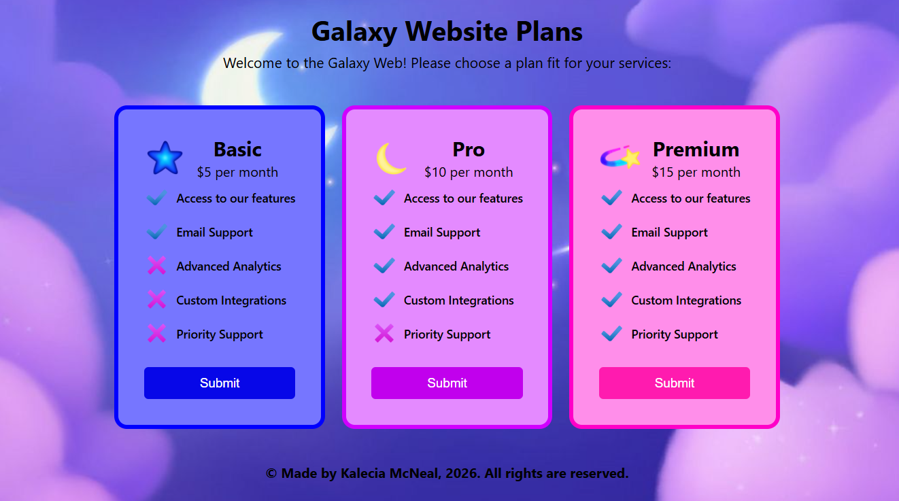

# 🌌 Galaxy Site Plans
#### By Kalecia McNeal

> *A simple web page display price plans for services*

## 📖 Description
This is a simple beginner project of a web page display some prince for basic website services.  

## 🧰 Tech and Tools Used
Languages I use while coding:
- HTML: 
  - Formatting 
  - Basic Semantics 
- CSS: 
  - Basic Styling
  - CSS Flexbox

Tools I use while coding: 
- Google Chrome Browser 
- Visual Studio Code 
- Chrome Dev Tools 

## 📸 Screenshots

## 💡 What I Learned

- Beginning: I started this project by creating three main divs as different price listings. Each one has its own icons, button, list and logo image. 

- Middle: Next, I completed some formatting for the headers, text, and spacing for each element using CSS styling and Flexbox. 

- End: Finally, I added some color to each price listing from blue to pink. Then I made some final touches by cleaning up some spacing issues. 

Credit: Thank you to Pinterest for the background image, Thank you to Icons8 for the checkmark and cross mark icons and the star, moon and rainbow trails belong to me!

## 🔗 Live Demo
(Coming Soon!)

## 🧭 Navigation Hub 
[← Back to Pages](https://github.com/Kalecia24824/Web/blob/main/Pages/README.md) | [← Back to Web](https://github.com/Kalecia24824/Web) | [← Back to Main](https://github.com/Kalecia24824)