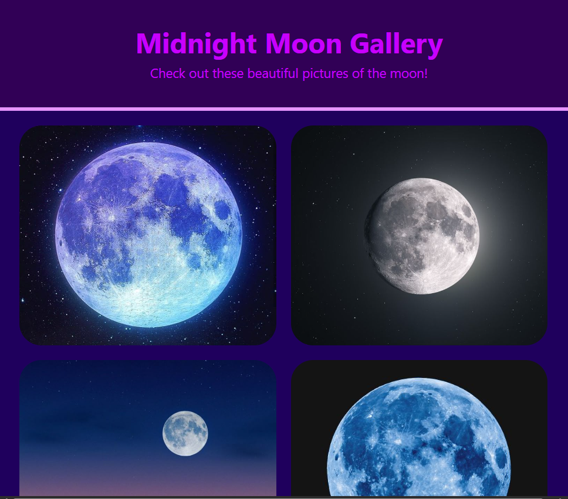

# 🌕 Moon Gallery
#### By Kalecia McNeal

> *A gallery displaying nine pictures of the moon taken by different photographers*

## 📖 Description
This is a simple beginner project of a web page that displays nine photos of the moon in a gallery.  

## 🧰 Tech and Tools Used
Languages I use while coding:
- HTML: 
  - Formatting 
  - Basic Semantics 
- CSS: 
  - Basic Styling
  - CSS Flexbox

Tools I use while coding: 
- Google Chrome Browser 
- Visual Studio Code 
- Chrome Dev Tools 

## 📸 Screenshots

## 💡 What I Learned
- Beginning: I started this project by coding my HTML basic and sematic elements including the images. 

- Middle: Next, I made my CSS file by adding some basic formatting such as the Box Model and CSS Flexbox (which was important in this project!)

- End: Lastly, I made sure to adjust the color scheme to the colors of the images so the page looked cohesive. In the end, I enjoyed using Flexbox. 

Credit: Thank you to Pinterest for providing the background for the project!

## 🔗 Live Demo
(Coming Soon!)

## 🧭 Navigation Hub 
[← Back to Pages](https://github.com/Kalecia24824/Web/blob/main/Pages/README.md) | [← Back to Web](https://github.com/Kalecia24824/Web) | [← Back to Main](https://github.com/Kalecia24824)