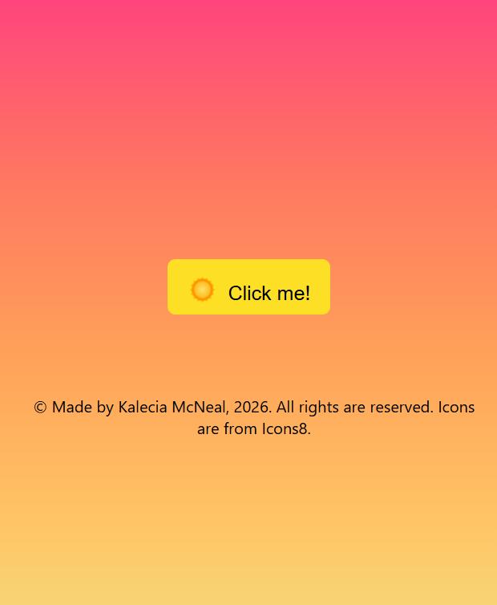
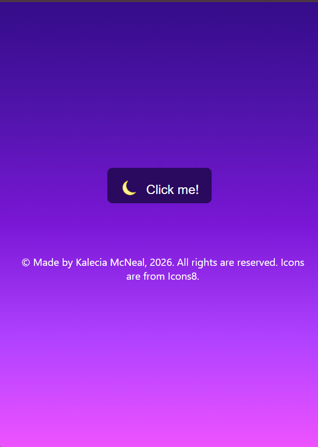

# 🌙 Night and Day Toggle
#### By Kalecia McNeal

> *A theme that changes from night to day!*

## 📖 Description
This project is a toggle which changes from night to daytime theme. 

## 🧰 Tech and Tools Used
Languages I use while coding: 
- HTML: 
  - HTML Formatting 
  - Buttons
  - Flexbox 

- CSS: 
  - Basic Styling 
  - Box Model
  - Variables
  - Animations

- JS: 
  - Variables 
  - HTML DOM model 

Tools I use while coding: 
- Google Chrome Browser 
- Visual Studio Code 
- Chrome Dev Tools 

## 📸 Screenshots

## 💡 What I Learned
- Beginning: My main goal for this project was to create a color changing button when someone clicks on it. Firstly, I added some simple HTML code using formatting and buttons. 

- Middle: In order to get the background colors to change for the button and page, I needed to use CSS variables. So, I used 2 different color schemes to achieve this. Then I added some CSS flexbox to make sure the page looks nice. 

- End: Finally with everything formatted, I needed to use responsive media queries to make sure the page is formatted for phones under smaller sizes. I also used a little bit of Javascript DOM model to achieve the color change and used some animations to make the transition flawless. 

In the end, I enjoyed making this color changing button. My only difficulty was using JS since I had to refer to my notes for help.

Thank you to Icons8 for providing icons for the buttons!

## 🔗 Live Demo
(Coming Soon!)

## 🧭 Navigation Hub 
[← Back to Pages](https://github.com/Kalecia24824/Web/blob/main/Pages/README.md) | [← Back to Web](https://github.com/Kalecia24824/Web) | [← Back to Main](https://github.com/Kalecia24824)