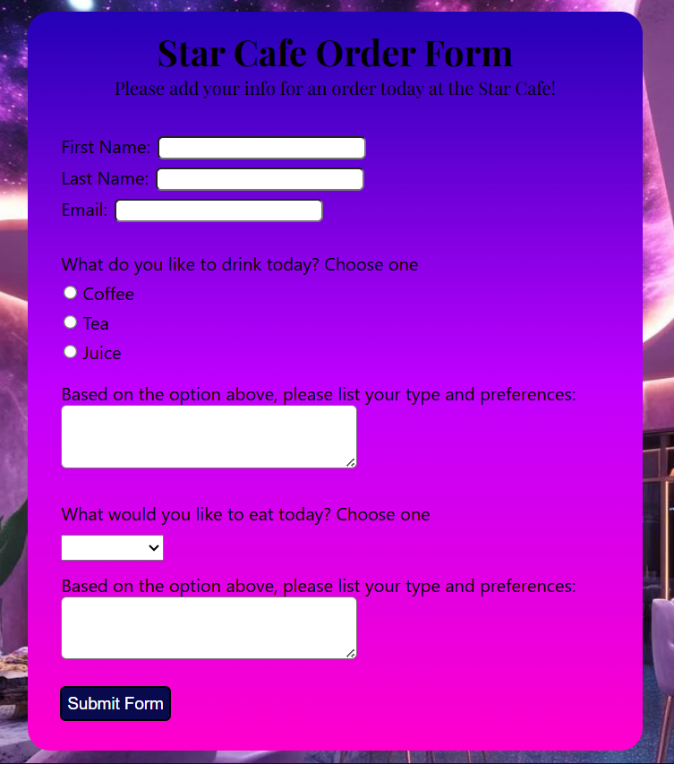

# 🌠 Star Cafe Form
#### By Kalecia McNeal

> *A form for customers to fill out for their orders at Star Cafe*

## 📖 Description
This project is a order form for customers to fill out their preferences and choices for their drinks and food at the cafe. 

## 🧰 Tech and Tools Used
Languages I use while coding: 
- HTML: 
  - Text Formatting 
  - HTML Forms 
  - HTML Buttons
- CSS: 
  - Basic Styling 
  - Border Boxing 
  - Box Model and Flexbox

Tools I use while coding: 
- Google Chrome Browser 
- Visual Studio Code 
- Chrome Dev Tools 

## 📸 Screenshots

## 💡 What I Learned
- Beginning: I started this project by coding the form which was the easiest part of the process.

- Middle: Then I added some formatting using the Box Model and Flexbox where I need to center the form on the page. 

- End: For the final part, the form needed some color so I went with a nighttime-themed color gradient. 

## 🔗 Live Demo
(Coming Soon!)

## 🧭 Navigation Hub 
[← Back to Pages](https://github.com/Kalecia24824/Web/blob/main/Pages/README.md) | [← Back to Web](https://github.com/Kalecia24824/Web) | [← Back to Main](https://github.com/Kalecia24824)